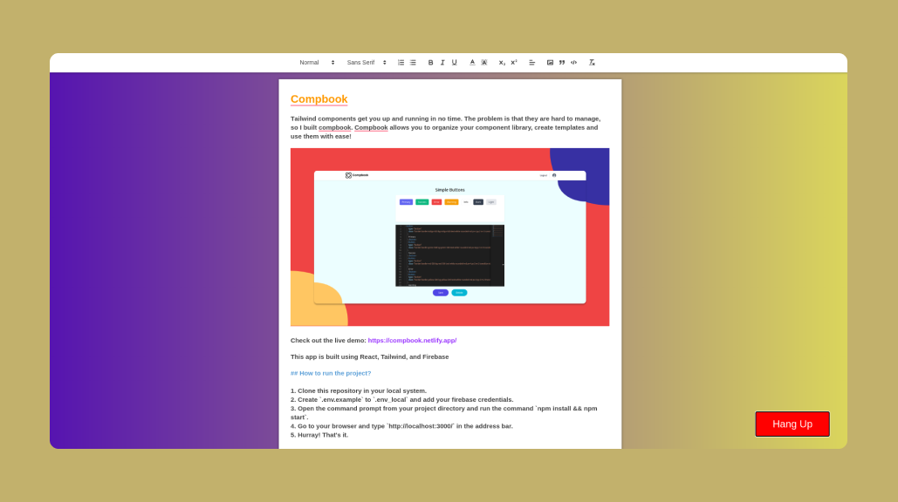

# DocWind Frontend

DocWind is a collaborative cloud document editing tool that allows you to edit a single document with multiple users in real-time. You can also use the in-build audio call function to call your colleagues and discuss the document in an efficient way.

Check out the live demo: https://docwind.netlify.app/

This app is build using Preact, Socket.io, and Simple-peer

## How to run the project?

1. Clone this repository in your local system.
2. Open the command prompt from your project directory and run the command `npm install && npm run dev`.
3. Go to your browser and type `http://localhost:8080/` in the address bar.
4. Hurray! That's it.
